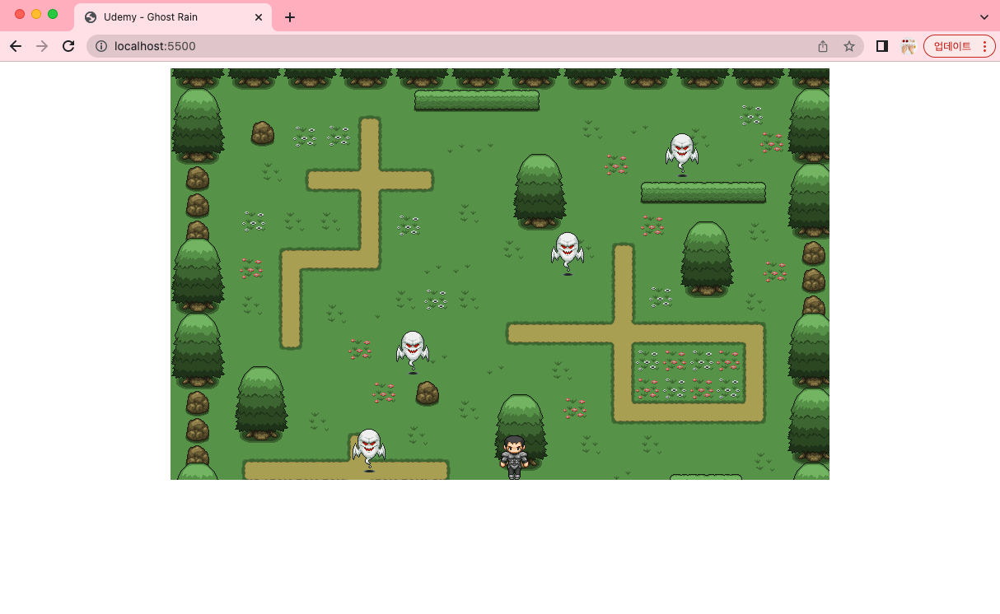
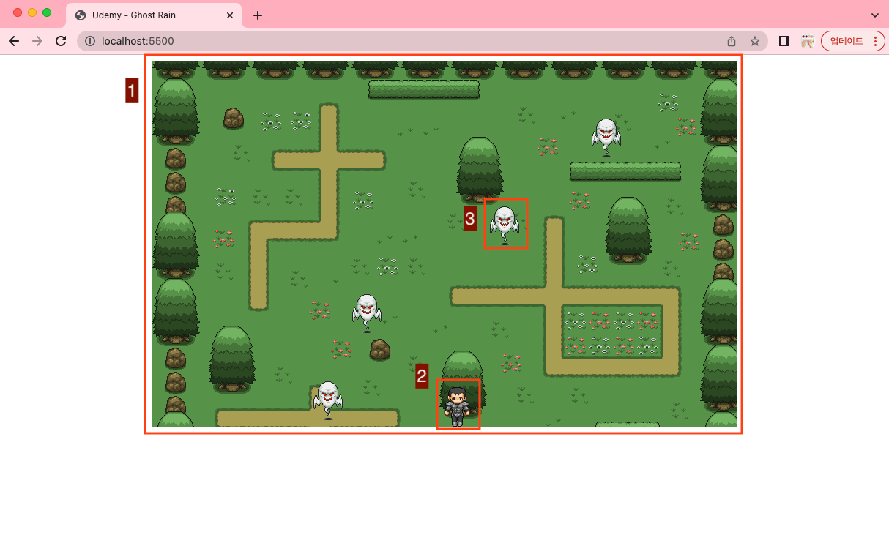
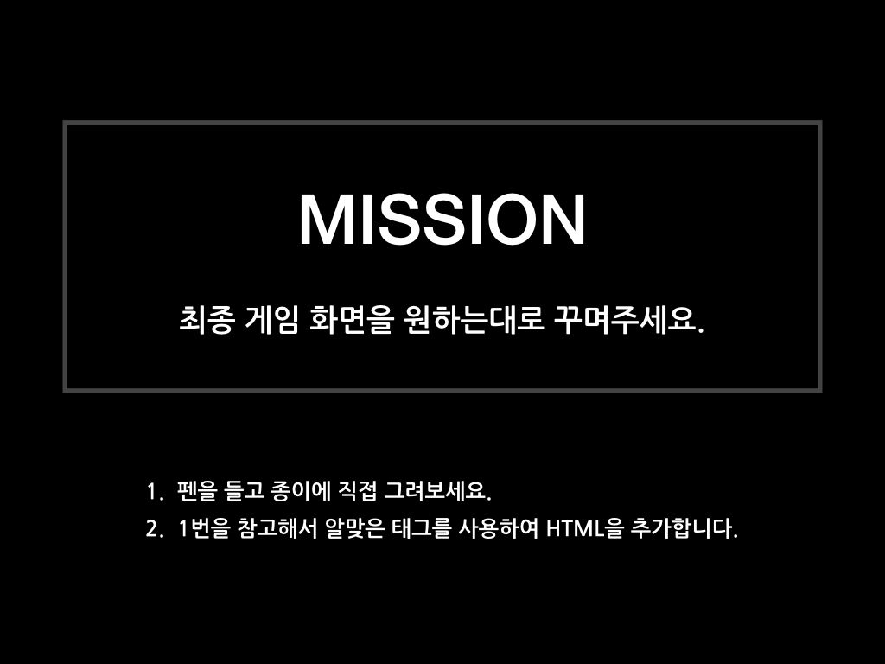
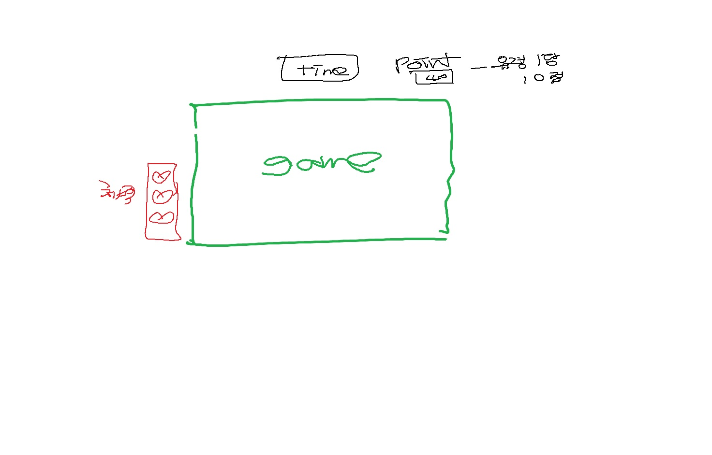

# Ghost Rain 화면 구성하기

## 최종 결과물

<br>



<br>

## 구성요소 살펴보기

- 분석하기

<br>



<br>

1. 게임의 배경

- 브라우저 한 가운데 위치해있음
- 이미지이다.

2. 용사

- 배경 내, 가운데 하단에 위치해있음
- 용사 역시 이미지이다.

3. 유령

- 배경 내에 있는데, 계속 움직이고 있음
- 하나의 유령이 나타났다 사라짐

## HTML 로 구현하기

```
<!DOCTYPE html>
<html>
  <head>
    <meta charset="UTF-8" />
    <title>Udemy - Ghost Rain</title>
  </head>
  <body>
    <div id="bg">
      <span id="hero"></span>
    </div>
  </body>
</html>
```

- index.html - 아직까진 실행시 하얀화면으로 아무것도 안 나오는게 정상임!

1. 게임의 배경

- 브라우저 한 가운데 위치해있음

  - > 한 가운데에 위치시키는 것은 CSS로 가능

- 이미지이다.

  - > HTML의 img태그를 활용해도 되고, 일반 태그(div)에 CSS의 배경이미지를 활용해도 됨

  <br>

2. 용사

- 배경 내, 가운데 하단에 위치해있음
  - > 가운데 하단 위치시키는 것은 CSS로 가능
- 용사 역시 이미지이다.

  - > 용사는 배경이미지를 활용한 기법을 사용해야하기 때문에 CSS를 사용

  <br>

3. 유령

- 배경 내에 있는데, 계속 움직이고 있음
  - > CSS를 실시간으로 조정하여 위치를 바꿀 수 없기 때문에 JavaScript를 활용해야 함
- 하나의 유령이 나타났다 사라짐

  - > HTML 요소를 추가했다 삭제 했다가 할 수 없기 때문에 JavaScript를 활용해야 함

  <br>
  <br>



<br>



## 간단한 아이콘 구하는 사이트

- 쉽고 빠르게!! (https://www.iconsdb.com/)

- 중국사이트라 조금 어렵긴 하지만, 믿을만한 사이트임 1000만개가 넘는 예쁜 아이콘이 많이 있고, github로 로그인하면 금방 다운받을 수 있음!(https://www.iconfont.cn/)
