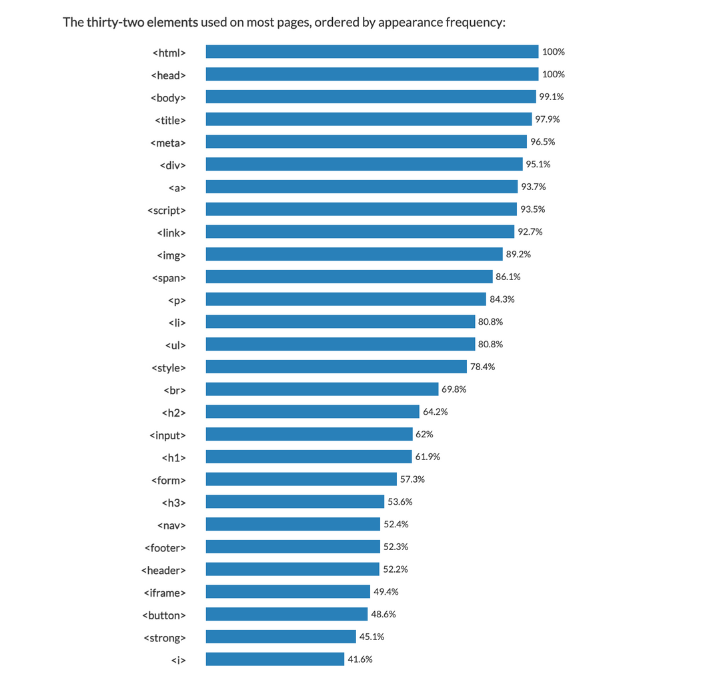

# HTML 다양한 태그의 활용

## 다양한 태그의 종료

- 현재 버전의 HTML 에는 150개 이상의 태그가 있음
- 평균적으로 32개의 다른 태그를 활용한다고 함

<br>



- 가장 상위에 있는 `html`, `head`, `body`, `title`, `meta`, `script`, `link`, `style` 같은 태그는 HTML 파일에 필요한 필수 태그이거나 해당 사이트의 설정을 위해 필요한 태그임

- 개발자가 잘 알아야 할 브라우저 화면의 내용을 꾸며줄 수 있는 태그는 `div`, `a`, `img`, `span`, `p`, `li`, `ul`, `br`, `h2`, `input`, `h1`, `h2`, `h3`, `nav`, `footer`, `header`, `button` 임

- [태그 - w3school 링크] (https://www.w3schools.com/tags/tag_a.asp)

## `<div>`,`<nav>`,`<footer>`

- `<div>`는 division의 줄임말로 웹사이트에서 섹션을 나눌 때 사용

  - `<a>`,`<p>`,`` 등의 태그는 그 자체로 어떤 기능을 하는지 명확히 알 수 있지만, `<div>` 는 자체로 의미가 있진 않음
  - `<div>`를 사용하는 이유는,

    - 비슷한 부분끼리 그룹지어주고
    - 디자인에 맞게 레이아웃을 분리해주고,
    - 각 `<div>`에 class 나 id 라는 속성(attribute)를 부여하여 css 스타일을 입혀줄 수 있기때문

    <br>

- `<nav>`나 `<footer>`도 `<div>`와 같은 섹션을 나눠주는 역할
  - nav는 navigation의 줄임말로, 주로 다른 페이지로 이동하는 링크를 모아놓는 영역을 `<nav>` 태그로 감싸줌
  - `<footer>` 는 하단에 기업 주소, 사이트 정보 등의 모음
  - 사실 `<div>`를 써도 되지만, 브라우저에 더 의미있는 정보를 전달하기 위해 내용에 맞는 태그를 사용하는 것을 추천

## `<p>`,`<span>`

- `<p>`
  - `<p>` 태그 또한 텍스트를 주로 넣어줌
  - `<p>` 는 paragraph 의 줄임말인 만큼, 주로 문단을 통으로 넣을때가 많음
  - `<p>` 태그는 `<span>` 태그와 달리 줄바꿈이 일어남

```
<p>tag들 파헤치기!!</p>
<p>아자!!</p>
```

- `<span>`
  - `<span>` 태그에는 주로 텍스트를 넣어줌
  - `<span>` 을 사용하면 줄이 바뀌지 않고, 한줄에 이어져 나옴
  - 이렇게 한 줄에 이어서 나오는 요소를 inline-element 라고 함

```
<span>이름: 김개발</span>
<span>직업: 프론트앤드 개발자</span>
```

## `<a>`

- `<a>` 태그는 클릭하면 화면이 이동
  - `<a>` 태그의 href 속성(attribute)에 이동해야 하는 주소를 써주면 됨
  - target 속성에 "\_blank" 값은 클릭하면 새창으로 뜨게 해주는 값

```
<a href="https://www.w3schools.com/tags/tag_div.asp" target="_blank">a 태그?</a>
```
