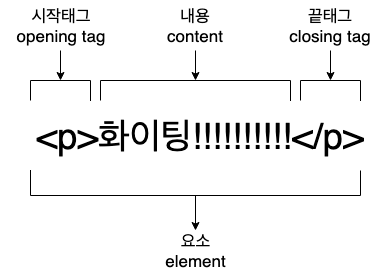

# HTML 의 기능

<br>

## 프로그래밍 언어와 웹 사이트

### 1. 프로그래밍 언어

- 코드(code) - 부호 또는 신호
- 소스(source) - 원천
- 언어(language) - 기계도, 사람이 이해할 수 있는 공통의 약속
  - 사람이 하는 일, 원인을 **프로그래밍 언어** 라고 표현

<br>

### 2. 웹사이트

- 프로그램(Program)
- 애플리케이션(Application)
- 앱(App)
- 웹(Web) / 웹 페이지(Web Page) / 웹 사이트(Web Site)
  - 기계가 하는일, 결과를 가리키는 표현

<br>

### 2-1 HTML은 웹 사이트를 만드는 프로그래밍 언어

- 다양한 종류의 프로그래밍 언어 ex) 자바(Java), 자바스크립트(JavaScript), 파이썬(Python), etc

<br>

### 2-2 HTML의 기능

- HTML로 웹 페이지의 구조를 잡음
- HTML 파일은 이미지, 텍스트, 비디오, 버튼 등 웹 사이트에 보여줄 내용을 구성
- 브라우저(Safari, Chrome, Internet Explorer..)는 HTML 파일의 코드를 분석하여 어떠한 요소를 생성하고, 어떻게 그려주면 되는지 파악한 후에 웹 페이지를 생성

<br>



<br>

## Tag(태그)

- 웹사이트에서 이미지(img), 텍스트(h, p, span), 영상(video), 구분(div) 등의 구성요소를 만들기 위해 HTML이 필요함

  - 그래야만 브라우저에서 '아, 이것은 텍스트구나, 저것은 이미지구나' 하고 할수있음

  <br>

- 태그는 <>로 감싸져 있음

```
<h1>제목</h1>
```

- 앞에 있는 태그는 시작 태그(opening tag), 뒤에 있는 태그는 종료 태그(closing tag)

  - 종료 태그는 시작 태그와 구분하기 위해 / (slash) 를
    붙임
  - 대부분의 태그는 시작 태그와 종료 태그가 함께 존재

- 시작과 동시에 종료되는 태그

```

<br>
```

- 위와 같은 태그는 시작 태그와 종료 태그 사이에 내용(content)이 필요 없기 때문

## Content (내용)

- 브라우저에서 태그(tag), 시작 태그와 종료 태그는 보여주지 않음
- 브라우저에는 태그 사이에 있는 내용(content)만 보여짐

```
<p>시작 태그와 종료 태그는 브라우저 화면에 보이지 않습니다.</p>
<p>시작 태그와 종료 태그 사이의 내용만 화면에 나타탑니다.</p>
```

## Attribute(속성)

- 이미지를 웹 페이지에 포함 시킬 때 태그의 이름은 `` (image 줄임말) 이미지 태그는 종료 태그없이 시작 태그만 작성

```

```

- 태그의 이름만으로 부족한 정보를 **속성** 사용하여 이미지에 대한 내용 추가

```

```

- src는 source, 출처의 약자로 원하는 이미지의 주소 or 경로가 들어감

  - src에 필요한 값은 "" (쌍따옴표) 로 감싸주어야 함
  - 한 태그에 여러 속성을 지정할 수 있음 (순서 상관X)

  <br>

```


```

- 태그의 이름만으로 정보가 부족할 때 속성을 통해 더 많은 의미를 부여 가능
  - [참고자료]
    (https://www.w3schools.com/html/html_attributes.asp)

<br>

## EIement(요소)

- 요소 = `<태그이름>내용</태그이름>`
- 요소(element) 시작 태그와 종료 태그 사이에 내용(content)이 있는 구조
- 종료 태그가 없으면 그 태그 자체로 요소가 됨 (ex.`,<br>`)
