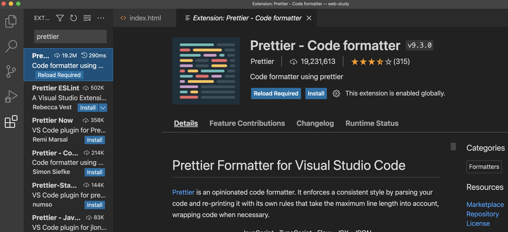
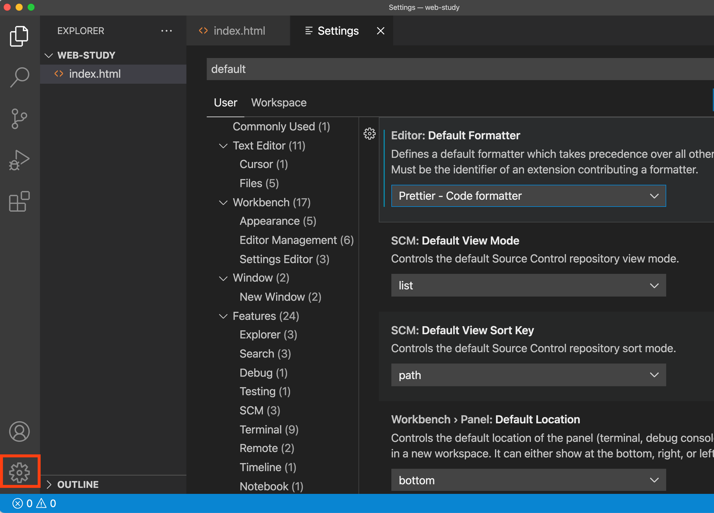
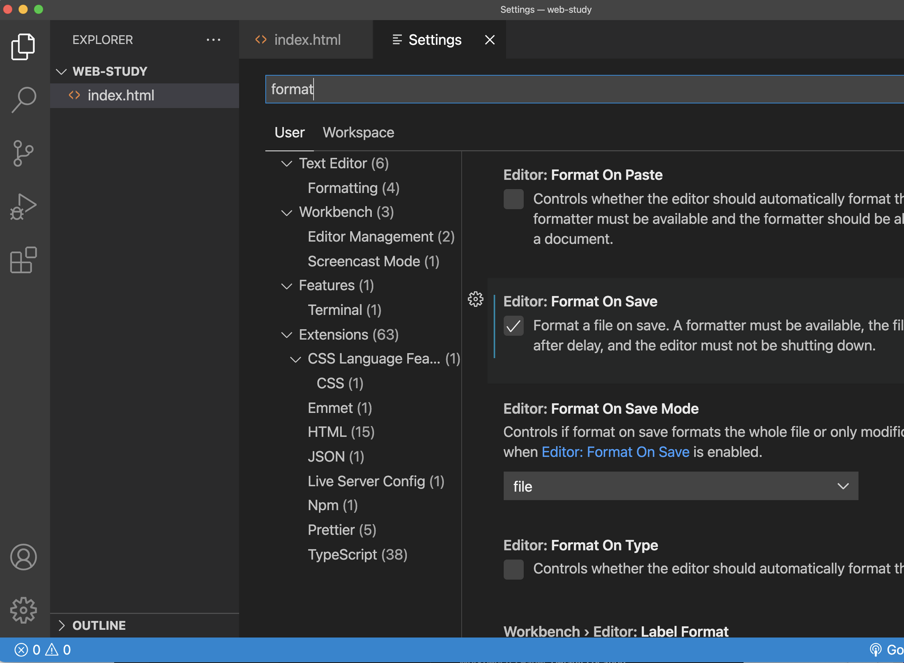
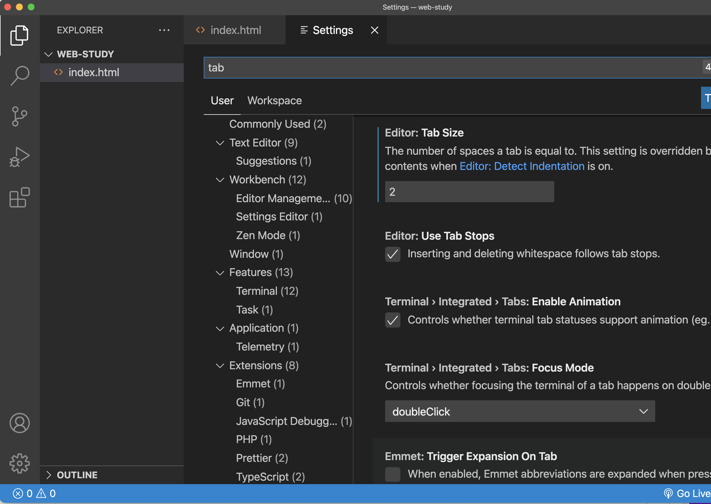

# VS Code 코드를 보기좋게 만드는 Prettier 설치하기

## Prettie

- Prettier(프리티어)는 코드를 보기 좋게 자동으로 변환해주는 Code Formatter 임

- 들여쓰기나 띄워쓰기, 쌍/홑 따옴표 등을 신경쓰지 않더라도 일관적인 코드스타일 을 유지할 수 있도록 도와줌

- 확장 버튼(좌측 하단 아이콘)을 클릭한 다음 Prettier 를 검색하고 Install 버튼을 클릭

 

# 설정

- 기본 formatter를 Prettier로 변경

  1. 왼쪽 하단의 설정 아이콘을 클릭하거나, command+, or Ctrl+, 으로 설정 화면으로 이동

  2. Settings 검색창에서 default 라는 키워드 검색

  3. Editor : Default Formatter 에서 Prettier - Code formatter 로 변경

   

  

- 저장할 때, 자동 포매팅 적용

  1. Settings 검색창에서 format 이라는 단어 검색
  2. Editor : Format On Save 에 체크

   

 

- 들여쓰기를 Tab 하나당, Space 2칸으로 설정

  1. Settings 검색창에서 tab 이라는 키워드 검색
  2. Editor : Tab Size 에 '2'로 변경

   

