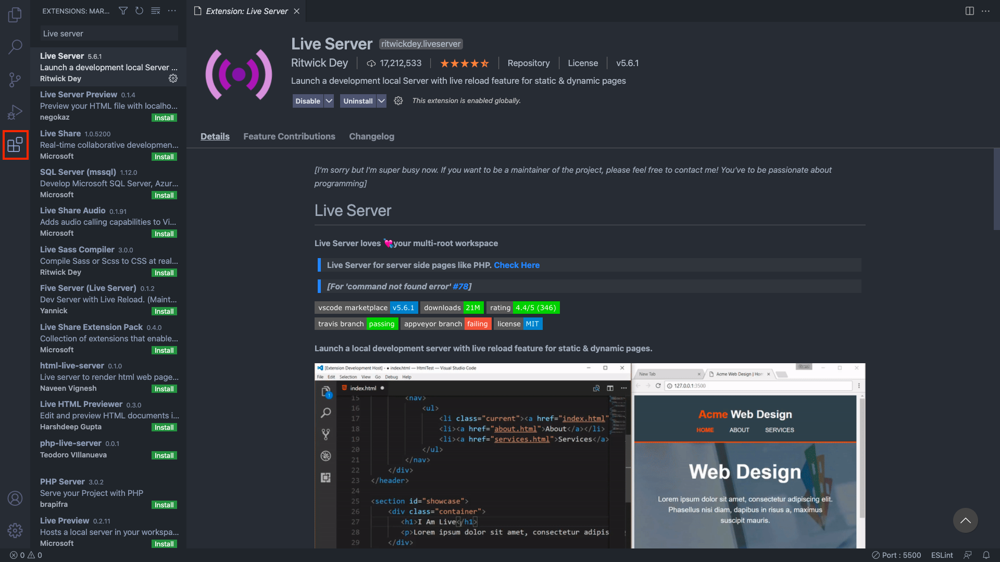
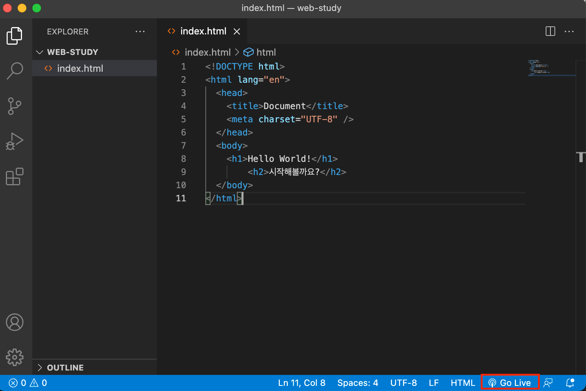
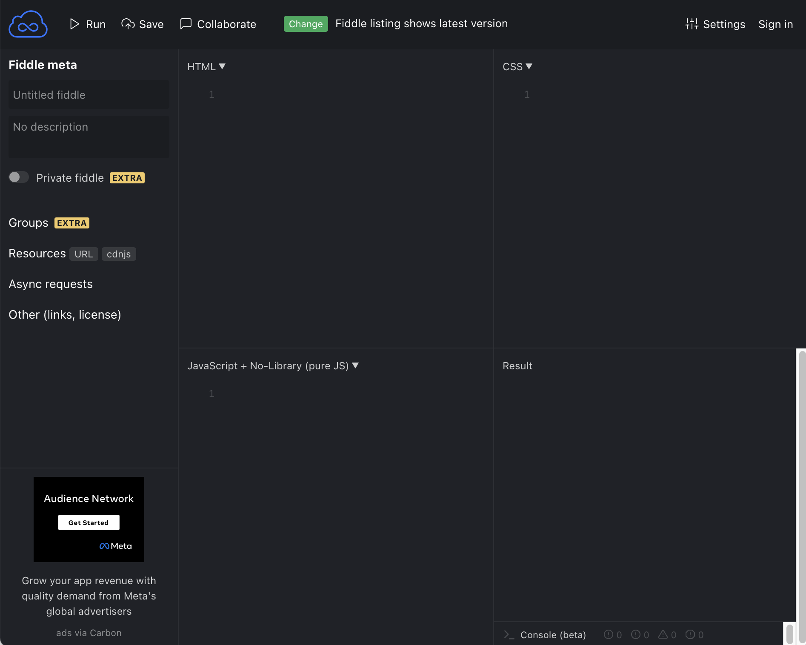

# 비주얼 스튜디오 코드(Visual Studio Code)

## 1. VS Code 설치

- [운영체제(window / Mac)에 맞게 설치  
  (https://code.visualstudio.com/)

 

## 2. Live Server 확장 플러그인

- 코드의 파일을 브라우저에서 직접 열어도 되지만 파일 경로 문제가 발생할 수 있음, 코드 수정 때마다 새로고침 해야하는 번거로움

 

- Live Server 라는 확장 플러그인을 이용하면 코드
  수정시마다 브라우저에 자동 반영

  - 에디터에서 작성한 코드를 브라우저에서 실행하는 방법

  - 확장 버튼(좌측 하단 아이콘, Extension) - Live Server 검색 - Install 버튼

 

- Live Server 확장 플러그인 설치시 Go Live 버튼이 나타남

    

- Go Live 클릭 시 브라우저에 HTML 파일이 자동 로딩 됨

  - 이후 코드 수정시 자동으로 반영되어 조금 더 편리하게 코드의 결과물을 브라우저 화면에 나타나게 할 수 있음

   

  ## 3. jsfiddle

- 빠르게 학습하고 쉽게 연습하고 싶으면 추천
- HTML, CSS, JavaScript 코드 창이 각각 있으며 결과 화면도 있어 바로 확인 가능
- 코드 작성 후 왼쪽 상단의 Run 버튼을 누르면 결과화면을 볼 수 있음
- 로그인시 본인이 작성한 코드 저장 가능
  - HTML Tag를 연습할때나, JavaScript 기능을 HTML과 연동해 확인하고 싶을때 사용 추천!

 

