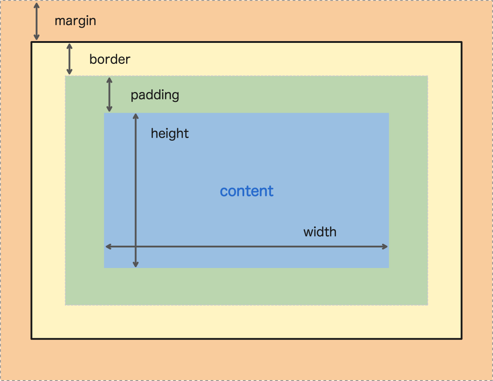
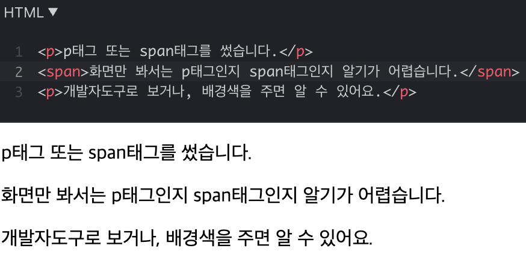
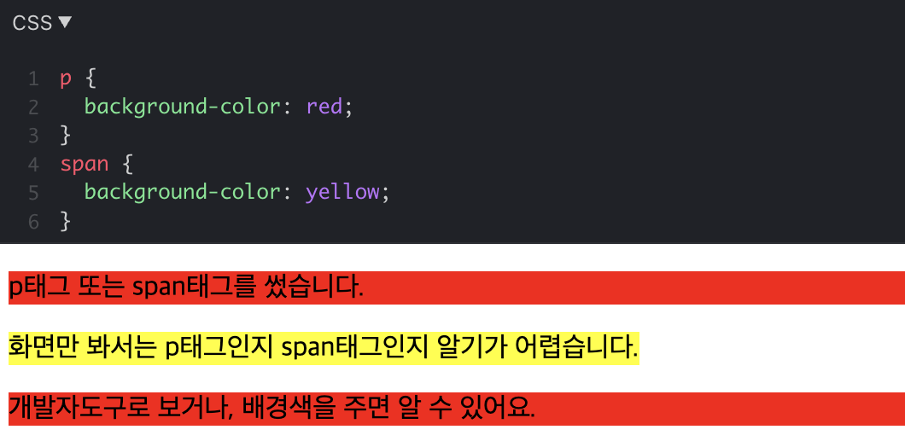
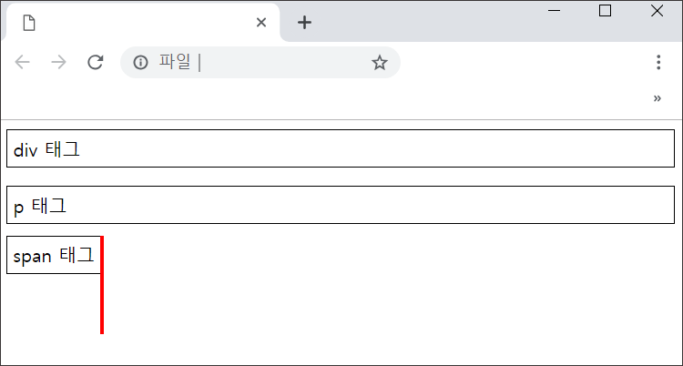
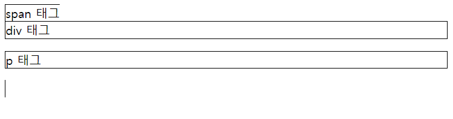
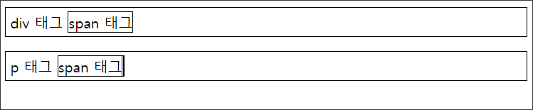
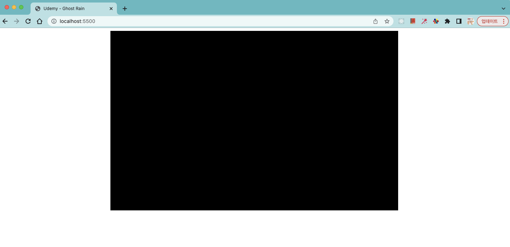

# CSS의 Box Model 과 게임배경 준비

## Box Model



<br>

## Block vs Inline

<br>



<br>



- HTML 태그는 기본적인 성격에 따라 영역을 차지
  - 블락 레벨 엘리먼트(Block level element) : 부모의 크기만큼 가로 전체를 차지 (부모가 없으면 브라우저 가로 전체를 차지)
  - 인라인 엘리먼트(inline element) : 자신(content)의 크기만큼을 차지

<br>

- 인라인 VS 블락의 디자인은 CSS로도 구현 가능

```
div {
	display: inline;
}
```

- > div는 블락의 성격을 갖고 있지만 CSS로 inline 요소처럼 바뀜!

<br>

### - `<div>` 태그와, `<p>` 태그 `<span>` 태그의 차이란?

```
<div>div 태그</div>
<p>p 태그</p>
<span>span 태그</span>
```



- > 결과

  - 블록 요소는 아래 그림의 `<div>` , `<p>` 처럼 태그의 영역이 브라우저의 양 끝을 모두 차지
  - 반면 인라인 요소는 그림의 `<span>` 태그의 영역 처럼 태그 안에 적힌 문자 정보의 길이만큼 영역을 차지

  - 따라서 문자 정보를 줄바꿈 하면서 작성해야 할 경우 `<div>` , `<p>` 태그를 사용해야 함
  - 반면 줄바꿈 없이 사용 영역만 작성하고 다른 블록 요소 등에 포함되어야 할 경우 `<span>` 태그와 같은 인라인 요소를 사용하면 됨!

  <br>

### - `<span>` 은 `<div>` , `<p>` 를 포함 할 수 없음

```
<span>span 태그
<div>div 태그</div>
<p>p 태그</p>
</span>
```



- > 더 작은 영역의 요소인 `<span>` 태그가 더 큰 영역을 가진 `<div>` , `<p>` 태그를 포함하려고 하면 레이아웃이 엉망이 됨

<br>

### - 더 영역이 큰 블록 요소인 `<div>` 와 `<p>` 태그는 인라인 요소인 `<span>` 태그를 포함할 수 있음

```
<div>div 태그 <span>span 태그</span></div>
<p>p 태그 <span>span 태그</span></p>
```



### - `<p>`는 `<div>`를 포함할 수 없음

### - `<div>`는 `<p>`를 포함 할 수 있음

<br>

## 여백과 테두리 - Margin, Padding, Border

```
div {
	margin: 20px;
	padding: 30px
	border: 1px solid black;
}
```

- 모든 요소는 Margin, border, padding 값을 갖고 있음
- margin 속성과 padding 을 사용해 요소와 요소 사이의, 혹은 요소 배누의 여백을 조절
  - margin : 바깥쪽 여백
  - padding : 안쪽 여백
- margin과 padding은 border를 기준으로 나뉨
- border 기준 바깥 영역 - margin (바깥여백)
- border 기준 안쪽 영역 - padding (안쪽여백)

## Content

```
div {
	width : 400px;
	height : 200px;
}
```

- HTML 요소 중 태그 사이의 내용(content)를 의미
- content의 폭은 width, 높이는 height

<br>

### 게임 배경 영역 확보하기

- 게임 배경의 위치를 파악할 수 있도록 id가 bg인 `<div>` 요소에 검정색 배경을 추가
- 같은 요소에 가로 800px, 세로 500px 을 추가해 공간을 확보
- margin을 적절히 조절해 브라우저 가운데에 위치시킴



<br>

### Margin & Padding (추가설명)

### - 동일한 값의 Margin & Padding

```
p {
  width: 273px;
  height: 90px;

  margin: 50px;
  padding: 50px;

	border: 5px solid black;
}
```

- 요소의 상하좌우 동일한 margin, padding 값을 갖는 경우, 한 줄로 값을 작성할 수 있음

### - 각 다른 값의 Margin & Padding

```
/* 4개의 다른 값을 지정할 때 */
margin-top: 25px;
margin-right: 50px;
margin-bottom: 75px;
margin-left: 100px;
/* 축약형 */
margin: 25px 50px 75px 100px;

/* 3개의 다른 값을 지정할 때 */
margin-top: 25px;
margin-right: 50px;
margin-left: 50px;
margin-bottom: 75px
/* 축약형 */
margin: 25px 50px 75px;

/* 2개의 다른 값을 지정할 때 */
margin-top: 25px;
margin-bottom: 25px;
margin-right: 50px;
margin-left: 50px;
/* 축약형 */
margin: 25px 50px;
```

- 요소의 상하좌우 각기 다른 값의 margin, padding 값을 부여
- 축약형) margin : top, right, left, bottom
