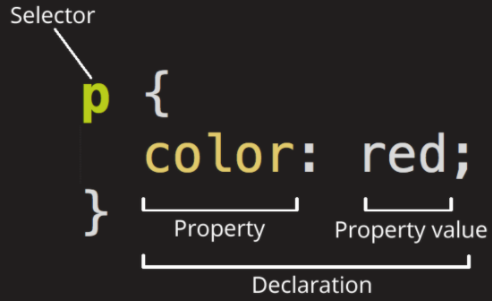
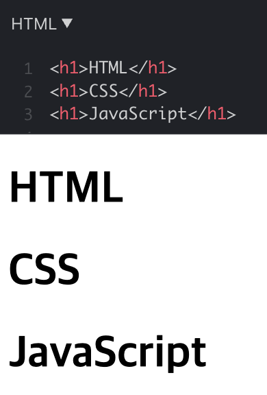

# CSS 기본 문법

## 1. 기본 문법

<br>

- `<p>` 태그의 글씨 크기를 정의하는 코드



- 선택자(selector)
  - 웹 페이지에서 스타일 효과를 누구에게 줄 것인가 선택한다는 점에서 선택자(selector)
- 선언(declaration) (=효과)
  - 선택자에 지정(선언)될 효과를 효과(declaration)라고 부름
- 속성 (property)
  - 적용하고 싶은 스타일 종류를 속성(property)라 부름
- 값(value)
  - 실제 적용되는 스타일 값을 속성(propertu)의 값(value)라고 함
- 세미 콜론(;)
  - 여러 줄의 스타일을 작성 시 각 줄을 구분하기 위해 구분자로서 세미콜론이 존재함
  - 스타일 효과를 지정한 다음 항상 세미콜론을 적어야 함

## 1-2) 태그(tag) 선택자

<br>

```
/* 모든 a 태그의 글씨 크기는 12px */
a {
  font-size: 12px;
}

/* 모든 span 태그의 글씨 굵기는 굵음 */
span {
  font-weight: bold;
}

/* 모든 nav 태그의 가로 길이는 200px, 세로 길이는 300px */
nav {
  width: 200px;
	height: 300px;
}

/* 모든 div의 배경색은 검정 */
div {
  background-color: black;
}
```

- 가장 기본적인 선택자로는 HTML 태그(tag)선택자가 있음
- 태그 선택자 사용 시 페이지 내 같은 종류의 태그에 일괄적으로 스타일 적용 가능

## 2. 특정 요소만 바꾸기(class, id)

<br>

- 다양한 CSS 선택자의 필요성



- 태그 선택자 사용 시, 페이지 내 같은 종류의 모든 태그에 일괄적으로 스타일을 적용
- > 왼쪽 목록은 모두 h1 태그를 사용했는데, 두 번째 요소인 "CSS"제목만 파란색으로 바꾸고 밑줄을 치고 싶다면?

```
h1 {
  color: blue;
  text-decoration: underline;
}
```

- > 위에서 배운 태그 선택자를 쓰면 모두 바뀌게 된다.

<br>

## 2-1) ID 선택자

<br>

```
<h1 id="html">HTML</h1>
<h1 id="css">CSS</h1>
<h1 id="js">JavaScript</h1>
```

- > HTML

```
#html {
  color: red;
}

#css {
  color: yellow;
}

#js {
  color: blue;
}
```

- > CSS

### - CSS에서 id가 있는 요소의 스타일을 주고 싶을땐 # 을 붙임

- id는 프로그래밍에서 '고유함'의 상징
  - id 선택자는 유일한 요소에 스타일을 정의할 때 사용
  - > 하나의 HTML 파일에서(= 한 페이지) 특정 id 이름을 가진 요소는 단 한개뿐
    - 즉 위의 코드에서 html이라는 id를 가진 요소는 오직 `<h1 id="html">HTML</h1>` 하나 뿐!

## 2-2) Class 선택자

<br>

```
<h1 id="html">HTML</h1>
<p class="content">HTML에 대해 배워보도록 하겠습니다.</p>

<h1 id="css">CSS</h1>
<p class="content">CSS에 대해 배워보도록 하겠습니다.</p>

<h1 id="js">JavaScript</h1>
<p class="content">JavaScript에 대해 배워보도록 하겠습니다.</p>
```

> HTML

```
#html {
  color: red;
}

#css {
  color: yellow;
}

#js {
  color: blue;
}

.content {
	font-size: 14px;
}
```

> CSS

- css에서 class가 있는 요소의 스타일을 주고 싶을 때는 점(.) 을 붙임
- 하나의 class는 여러 요소에 '같은 이름'으로 부여할 수 있음
- classs 선택자는 여러 요소에 동일한 디자인을 적용할 때 사용

<br>

## 3. 다양한 CSS 효과

- W3Schools | CSS Reference
  - (https://www.w3schools.com/cssref/)
  - 웹 기술 온라인 학습을 위한 사이트
