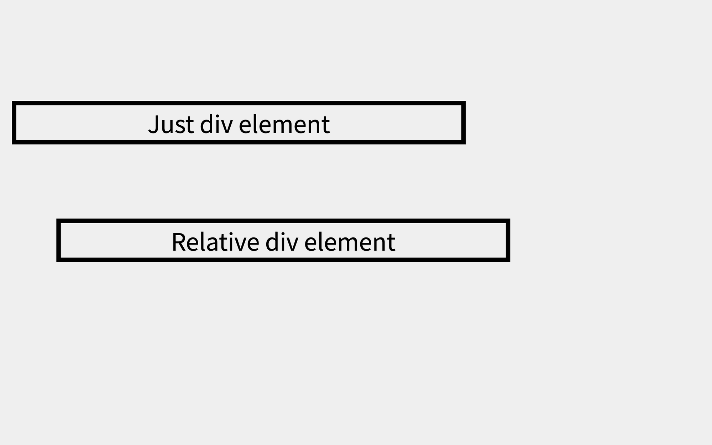
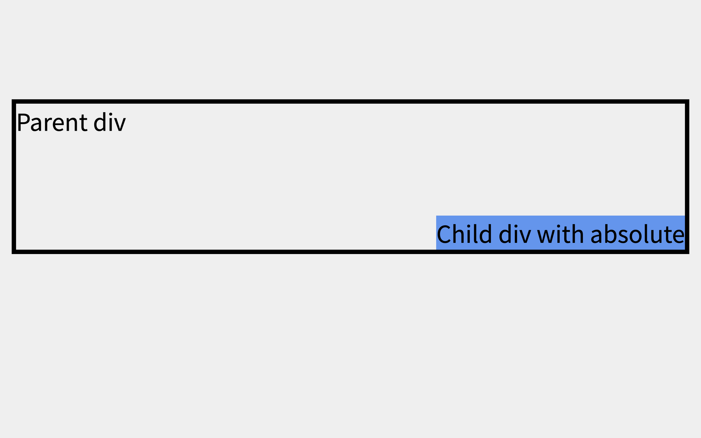
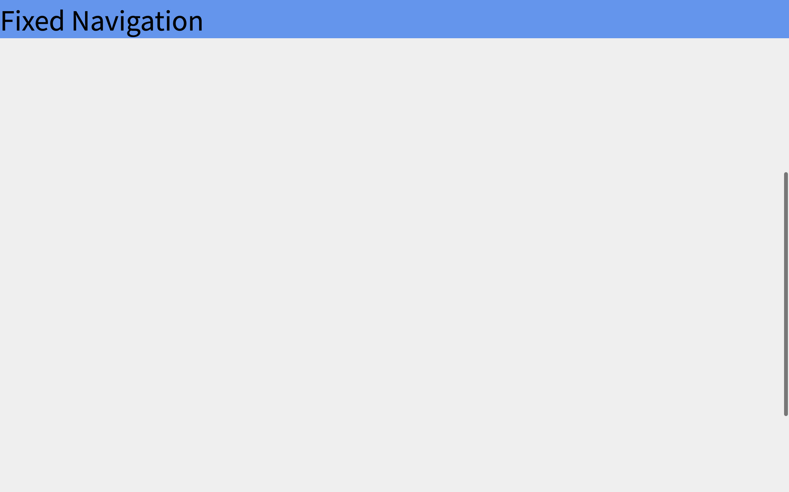

# CSS의 position으로 용사 위치 잡기

## Position

## 1-1) Position 속성의 기능

- HTML 요소는 기본적으로 코드가 작성된 순서대로 페이지에 그려짐 (위 -> 아래 , 좌 -> 우)

- 코드가 작성된 순서와 상관없이, 요소를 원하는 위치에 두기 위해선 어떻게 할 수 있을까?
- > CSS position 속성을 사용하면 HTML 요소를 원하는 위치에 배치할 수 있음

## 1-2) Position 속성의 종류

- position 속성에서 사용하는 값은 4개가 있음
- position: static;
- position: relative;
- position: absolute;
- position: fixed;

<br>

## relative

### 2-1) relative 이론

- position: relative 자체로는 특별한 의미가 없음, 즉 요소의 위치가 이동하지 않음
- top, right, bottom, left 속성을 함께 부여해야 원래의 위치에서 이동할 수 있음
- top, right, bottom, left 는 position 이라는 속성이 있을 때만 적용되는 속성

### 2-2) relative 실습



```
<div class="just_div">Just div element</div>
<div class="relative_div">Relative div element</div>
```

```
div {
  width: 300px;
  text-align: center;
  border: 3px solid black;
}

.relative_div {
  position: relative;
  top: 50px;
  left: 30px;
}
```

- .relative_div 요소는 기본적인 div 요소와 같은 크기의 결과로 화면에 나타남
- position: relative 속성과 top, left 속성을 부여해 위치를 이동시킴

> Q) top 속성의 값으로 마이너스 값을 주면 어떻게 될까

- 상단 기준선 위에 위치하게 됨

  <br>

## 3. absolute

### 3-1) absolute 이론

- position: absolute 속성은 이름의 뜻과 같이 절대적인 위치에 요소를 배치
  - 특정 부모의 위치를 기준으로 절대적으로 움직임
- 부모중 position 속성에 relative, fixed, absolute 하나라도 적용돼 있으면 그 부모의 위치를 기준 절대적으로 움직이게 됨
- 일반적으로 position: absolute를 적용하는 경우, 위치의 기준으로 작용하는 부모 요소에 position 속성이 없다면 position: relative를 부여함

<br>

### 3-2) absolute 실습



```
<div class="parent">
  Parent div
  <div class="absolute_child">Child div with absolute</div>
</div>
```

```
.parent {
  position: relative;
  border: 3px solid black;
  height: 100px;
}

.absolute_child {
  position: absolute;
  right: 0;
  bottom: 0;
  background-color: cornflowerblue;
}
```

- .absolute_child 요소에 파란색 배경을 추가
- div 태그는 block element 임 따라서 가로 크기가 부모 너비만큼 전부 차지해야 함
- 하지만 absolute 속성이 부여 되면서 inline element 로 작영해 내용의 크기만큼 너비가 지정돼 있음

  - absolute 값을 갖게 되면 내용의 크기만큼 너비가 지정됨

- right: 0 의 의미는 부모 요소를 기준으로 오른쪽에서 0만큼 떨어짐
- bottom: 0 의 의미는 부모 요소를 기준으로 아래에서 0만큼 떨어짐

<br>

## 3. fixed

### 3-1) fixed 이론

- fixed 는 단어 그대로 '고정됐다'는 뜻
- fixed 속성은 마우스 스크롤의 움직임과 상관없이 특정 요소를 화면의 특정 위치에 고정해 보여줄 때 사용하는 속성
- absolute 적용시엔 position 속성을 가진 부모가 필요했는데, fixed는 그럴 필요가 없음
- fixed 속성은 브라우저 화면을 기준으로 요소를 위치시키기 때문

<br>

### 3-1) fixed 실습



```
<nav>Fixed Navigation</nav>
```

```
body {
  height: 200vh;
  background-color: #efefef;
}

nav {
  position: fixed;
  width: 100%;
  background-color: cornflowerblue;
}
```

- 스크롤을 내릴 수 있도록 body 의 높이를 전체 화면의 두 배 크기인 200vh 로 지정했음
- position: fixed 속성을 부여해 화면의 상단에 위치를 고정함
- position: fixed 속성을 부여해 요소는 inline 속성을 지니게 됨
- 화면 전체 너비로 가로 길이를 지정하기 위해 width: 100% 값을 부여
- 스크롤 위치에 상관없이 화면 상단에 nav 요소가 고정된 것을 확인
