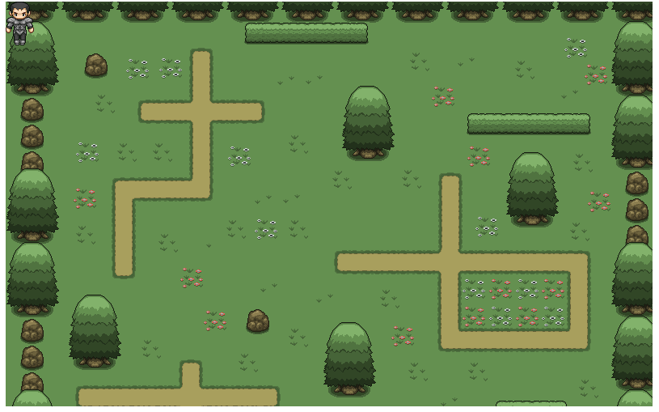
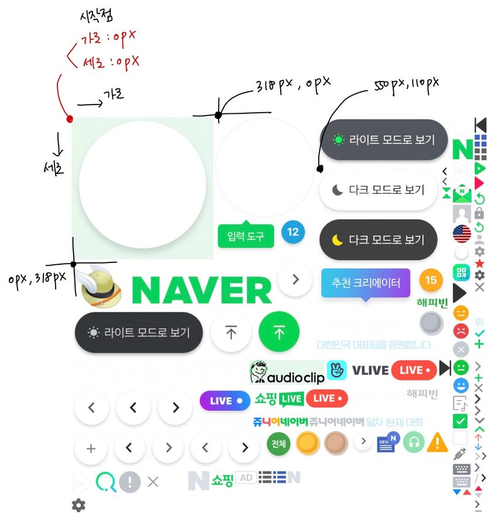
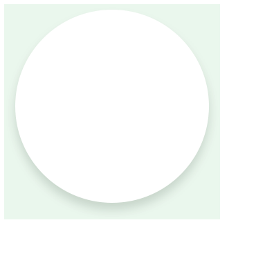
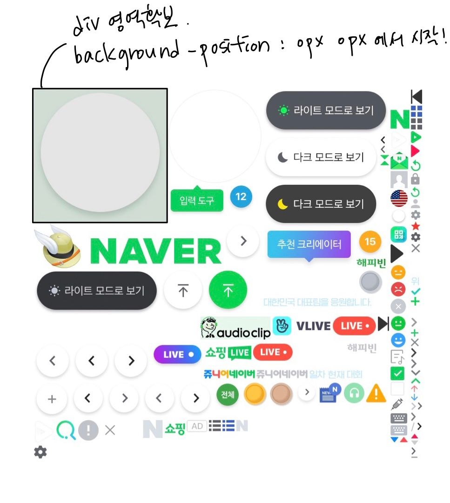
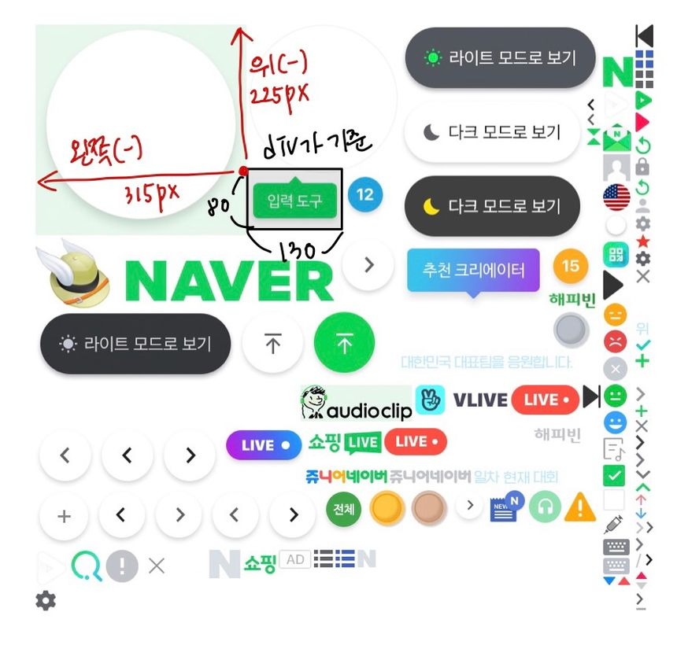

# 웹페이지에 이미지 추가하는 2가지 방법
### 1.HTML의 `` 태그로 이미지를 추가
### 2.태그는 아무거나 사용하고 CSS의 background-image 속성을 사용

<br>

### 1-1) ``태그로 이미지 넣기
```

```
- `` 태그를 사용하는 경우
  - 구글,네이버 등 이지 검색에도 노출이 필요한 경우
  - 페이지에 중요한 역할을 하는 경우
  - 프린트 했을 때 출력이 되어야 하는 경우

<br>

- Ghost Rain에서 배경이미지는 실제로 배경의 역할을 하기 때문에 img 태그를 사용하지 않고, css의 배경 속성을 활용해 이미지를 추가

<br>

### 1-2) CSS의 background-image를 활용해 이미지 넣기
```
<div class="bg-img">
</div>
```

```
.bg-img {
	height: 500px;
  background-image: url("https://s3.ap-northeast-2.amazonaws.com/cdn.wecode.co.kr/landing/bootcamp/boot_1.jpg");
}
```
- `<div>`에 아무 내용도 없기 때문에 영역이 확보되지 않아 높이가 0 높이를 부여하고 배경을 추가

<br>

## 2. 이미지 직접 적용하기
### 2-1) 게임 배경 이미지 추가
```
#bg {
  width: 800px;
  height: 500px;

  background: url('./images/bg.png') no-repeat;
  background-size: cover; 

  margin: 0 auto;
}
```

<br>

### 2-2) 용사 이미지 추가

```
#hero {
  width: 35px;
  height: 54px;

  background: url('./images/hero.png') no-repeat;
}
```


- > 용사가 화면에 나타나면 성공!

- hero가 `<span>`인 경우 위와 같이 css를 적용해도 화면에 보이지 않는 이유는?

  - `<span>`태그는 inline 요소 임. inline 요소는 width의 기본 값이 0px이고, width을 갖기 위해선 `<span>`태그 사이에 content(텍스트값)이 존재해야만 함

  - `<span>`태그는 content가 없다면, CSS에서 width값을 설정해도 가로값이 생기지 않고 계속 0px이기 때문에 용사가 보이지 않음!

    - hero를 `<div>`로 바꿔서 block요소의 성질을 갖게 하거나
    - CSS에서 `display:inline-block;` 이라는 프로퍼티를 추가해 block의 장점을 가진 inline 요소로 변경

<br>

## 3. Image Sprite (이미지 스프라이트)
- Image Sprite란?
  - 화면에 필요한 이미지 하나하나가 파일이고, 네트워크 요청을 하기 때문에 비용이 든다

  - 하나의 그림 파일에 모든 이미지를 담아 -> 위치를 조정해 사용하는 법

- 장점
  - 하나의 그림 파일에 10개의 아이콘이 있으면 10번 요청 -> 1번 요청으로 줄어들어 웹 성능이 좋아짐

  - 이미지를 가져올 때마다 화면에 그리기 위해 약간의 깜빡임이 있는데, 하나의 그림파일을 사용하면 이미 브라우저에 사용됐던 파일이라 깜빡임이 없음

- 단점
  - 디자이너와 소통이 필요함
  - 이미지가 하나만 수정돼도 파일이 변경돼야 함
  - 각 이미지의 위치를 정확히 관리해야 함

## 3-1) Image Sprite 기법 파헤치기

> Image Sprite 중에서 원하는 이미지 사용

<br>



```
<div class="empty-profile"></div>
```

```
.empty-profile {
  width: 314px;
  height: 314px;
  
  background: url("https://s.pstatic.net/static/www/img/uit/sp_main_dba1af.png") no-repeat;
}
```

> 결과화면

<br>



<br>

> div 영역 외에 숨겨져 있는 나머지

<br>



<br>

> background-position 으로 배경 조정

<br>

```
<div class="input-tool"></div>
```
```
.input-tool {
  width: 130px;
  height: 80px;
  
  background: url("https://s.pstatic.net/static/www/img/uit/sp_main_dba1af.png") no-repeat;
  background-position: -315px -225px;
}
```

> 결과확인

<br>


<br>

> 숨겨진 화면

<br>



- div가 기준으로, 배경이미지가
  - 위로 225px 만큼 올라가고
  - 왼쪽으로 315px 만큼 이동함

<br>

## 3-2) 용사 시선 처리하기

- class 이름이 stop이면 정면을 바라보는 이미지 position으로 적용
- class 이름이 right이면 정면을 바라보는 이미지 position으로 적용
- class 이름이 left이면 정면을 바라보는 이미지 position으로 적용


### 참고사항

- 용사의 요소 `<span id="hero"></span>`에는 #hero의 id가 적용되어 있습니다. 하나의 요소에 id와 class 두가지 속성을 모두 사용할 수 있습니다.
- 우리가 지금 할 일은 class 이름에 맞게 이미지 위치가 바뀌도록 CSS를 작업하는 일입니다.
  - `<span id="hero" class="stop"></span>` 이면 정면을 바라보고
  - `<span id="hero" class="right"></span>` 이면 오른쪽을 바라봅니다.

    - class이름이 stop → right로 변경되는 것은 자바스크립트로 할 수 있음 키보드 우측키를 누를 때 변경되게 할 예정