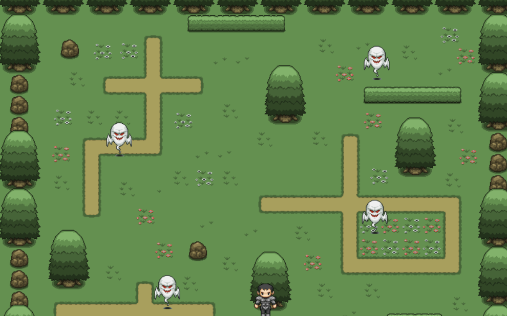
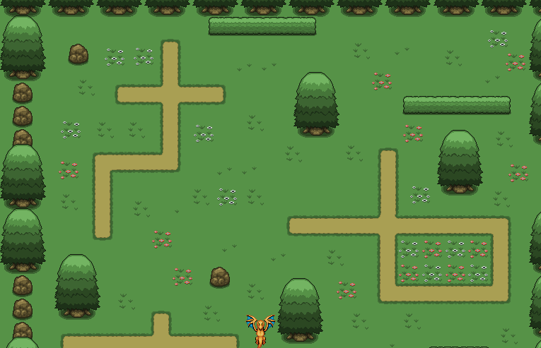
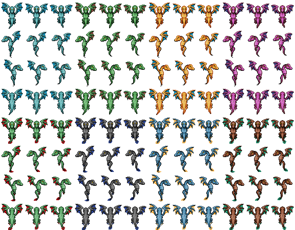

## Image Sprites 용사 캐릭터를 다른 image 캐릭터로 바꿔 볼 수 있을까?

- 우선 이미지 스프라이트란 하나의 그림 파일에 모든 이미지를 담아 위치를 조정해 사용합니다.

 

- 장점으론

  - 이미지를 다운받기 위한 서버 요청을 단 몇번으로 줄일 수 있고, 웹 페이지의 로딩 시간을 단축해줍니다.
  - 많은 이미지 파일을 관리하는 대신 몇 개의 스프라이트 이미지 파일만 관리하면 돼서 매우 편리합니다.

   

- 단점으론
  - 디자이너와의 소통이 매우 필요하고, 이미지가 하나만 수정돼도 파일이 변경돼야 합니다.
  - 각 이미지의 위치를 정확하게 관리해야만 합니다

 

- > 그래서 저는 일단 원본의 히어로 이미지파일과 똑같이 이미지 스프아리트를 사용해 히어로의 이미지 파일을 CSS에서 background-image로 주고 노란 용 이미지로 교체해봤습니다.
- > 위에 설명했던 것처럼 하나의 그림 파일에 용의 여러 이미지를 담아 위치를 조정해 사용했고 hero 요소에 position: absolute를 사용하고 각각 stop, right, left들에 background-position을 사용해 위치를 정해줬습니다.

- > position: absolute는 이름의 뜻과 같이 절대적인 위치에 요소를 배치하는데, 그 부모의 위치를 기준으로 절대적으로 움직이게 됩니다.

- > background-position은 배경이미지가 표시되는 위치를 조절합니다.

 
 

- > 원본 용사

 
 

- > 바꾼 노란용

 
 

- > 스프라이트 이미지

 

### 코드는 이쪽에서 확인해주세요!

- (https://github.com/Chooteacher/udemy-ghost-rain-clone/blob/main/index.html)

  - > html 코드

- (https://github.com/Chooteacher/udemy-ghost-rain-clone/blob/main/style.css)

  - > css 코드
