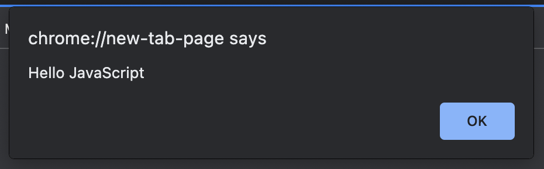

# JavaScript의 기능

## 1) 동적 웹

- 웹과 사용자의 상호작용
- 우린 지금까지 수 많은 웹 서비스를 유저(User), 즉 사용자로서 사용했음

  - 아이디, 비밀번호를 입력하고 로그인 버튼을 눌렀을 때
  - 쇼핑몰에서 원하는 상품을 장바구니에 담거나 주문할 때
  - 인터넷 강의를 빠르게 듣기 위해 2배속을 클릭할 때
  - 이 모든 과정이 웹 페이지와 사용자 간의 상호작용임

  <br>

## 2) 자바스크립트의 기능

- 자바스크립트(JavaScript)는 웹과 사용자 간의 동적인 상호작용을 위해 만들어진 언어
- 브라우저에서 사용자 행동을 처리하고, 데이터를 저장하고, 네트워크 응답과 요청을 처리하는 역할

<br>

## 2-2) 예시 alert



- 웹 페이지를 동적으로 만들어주는 자바스크립트에서 소개하는 첫 번째 함수는 alert() 함수

  - 특정 요소를 클릭한 다음에 뜨는 작은 박스, 이러한 작은 박스를 웹에선 alert창(알림창) 이라고 부름
  - 위의 알림창을 만들기 위해 HTML의 `<div>` 태그를 만들고, CSS를 이용해 버튼을 파란색으로 스타일링 하고.. 굳이 이렇게 할 필요없이 JavaScript 코드로 알림창을 띄울 수 있음

  - 참고) 브라우저(IE,Chrome,Safari,Firefox)마다 기본적으로 정해진 알림창이 있으며, 각각 정해진 디자인을 따르기 때문에 다른 모양을 갖게됨

- 아래는 "안녕하세요!" 라는 메세지의 알림창을 띄워주는 코드

```
alert("안녕하세요!")
```

- 로그인 비밀번호가 틀렸을 때 "비밀번호가 틀렸습니다" 라는 텍스트로 알림창을 보여줄 수 있음.
- 디자인이 더욱 가미된 알림창을 보여주면 좋겠지만 개발을 급하게 해야 하는 경우엔 HTML, CSS작성할 시간을 단축하기 위해 브라우저의 기본 알림창을 사용하는 경우도 많음
