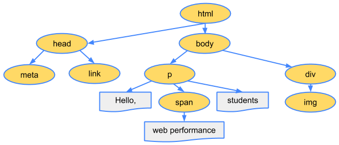

# DOM이 무엇이고 왜 필요할까?

## 1.HTMl과 CSS의 만남 (HTML -> CSS)

- Inline Style

```
    <ul>
	<li style="color: red">Ghost Game</li>
	<li style="color: red">Shooting Game</li>
	<li style="color: red">About</li>
</ul>
```

- `<style>` tag

```
    <!DOCTYPE html>
<html>
  <head>
    <title>Udemy - Game</title>
    <meta charset="UTF-8" />
		<style>
			li {
				color: red;
			}
		</style>
  </head>
  <body>
		<ul>
			<li>Ghost Game</li>
			<li>Shooting Game</li>
			<li>About</li>
		</ul>
	</body>
</html>
```

- CSS 파일 분리(.css)

```
li {
	color: red;
	background-color: yellow;
}
```

## 2.HTML과 JavaScript의 만남 (HTML -> JavaScript)

- `<script>` tag

```
<!DOCTYPE html>
<html>
  <head>
    <meta charset="UTF-8" />
    <title>JavaScript</title>
  </head>
  <body>
    <h1>JavaScript</h1>
    <script>
      alert("Hello JavaScript!");
    </script>
  </body>
</html>
```

- JavaScript 파일 분리 (.js)

```
const loginBtn = document.getElementsByClassName("button")[0];

loginBtn.addEventListener("click", function () {
  const id = document.getElementById("id").value;
  const password = document.getElementById("password").value;

  if (!id) {
    alert("아이디를 입력해주세요!");
    return;
  } else if (!password) {
    alert("비밀번호를 입력해주세요!");
    return;
  } else {
    alert("로그인 성공!");
  }
});
```

## DOM (JavaScript -> HTML)

- 자바스크립트에서 동적 기능 구현을 위해 HTML 웹 페이지에 접근
- 자바스크립트 로직을 통해 동적 웹 페이지를 구현하기 위해선 우선 HTML요소에 접근해야 함

```
<p>Hello students!</p>
<button id="btn" type="button">Click Me</button>
```

> HTML

```
// button 요소에 접근 (HTML 요소에 접근)
const btnElement = document.getElementById('btn');

// button 요소에 이벤트 부여 (클릭시 알림창 출력) >>> 동적 기능 구현
btnElement.addEventListener('click', function () {
	alert('Welcome to Wecode Coding Bootcamp!');
});
```

> .js

- 위처럼 자바스크립트에서 HTML 페이지에 접근해 여러가지 조작(스타일 수정, 요소 생성, 내용 수정, etc)을 할 수 있도록 하는것이 DOM 임

<br>

# DOM 정의

```
<!DOCTYPE html>
<html>
  <head>
    <title>Critical Path</title>
  </head>
  <body>
    <p>Hello <span>web performance</span> students!</p>
    <div></div>
  </body>
</html>
```



> DOM을 통해 HTML 파일의 요소들을 -> 위의 그림과 같이 노드(Node)의 계층 구조(Tree)로 표현

- DOM(Document Object Model) 문서 객체 모델

  - D(Document): 웹 페이지 문서 (=HTML)
  - O(Object): 객체
  - M(Model): 모델

- DOM은 HTML을 계층화시켜 트리(Tree) 구조로 만든 객체(Object) 모델(Model) 임

  - document 객체는 DOM 트리의 Root Node, 즉 `<html>`요소에 접근하게 해줌

- DOM은 웹 페이지 문서, 즉 HTML과 자바스크립트를 서로 잇는 역할
  - 자바스크립트는 DOM을 통해 HTML 페이지에 접근하고 페이지를 수정할 수 있음
  - 자바스크립트 코드에서 document라는 변수로 접근 가능
