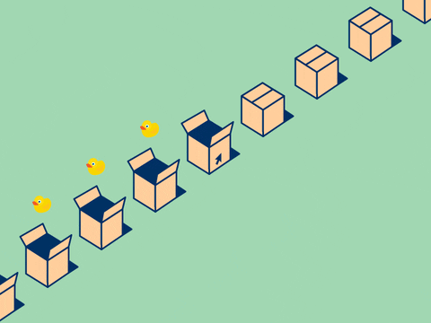

# 사용자 Event의 종류와 감지

## 1) 이벤트(User Interaction)와 함수



- 웹 페이지엔 사용자의 상호작용(User Interaction)이 다양하게 존재
- 상호작용은 크게 이벤트(Event)와 동작으로 구분할 수 있음. 동작은 로직이나 함수(Function)로 구현하게 됨

  - `이벤트` 마우스를 드래그 -> `함수` 박스가 움직임
  - `이벤트` 박스를 클릭 -> `함수` 박스가 열림 -> `함수` 1초 후 오리가 나옴

- 이벤트(Event)

  - 이벤트는 사용자에 의해 발생
  - 이벤트란, 특정 요소와 사용자 사이의 `상호작용(Interaction)`을 의미
  - ex. 마우스 클릭, 마우스 드래그, 스크롤 이벤트, 키보드 이벤트

- 함수(Function)

  - 함수는 사용자가 발생시킨 이벤트의 결과
  - 이벤트 발생시 동작하는 일(기능)을 미리 정의하는 코드의 모음을 의미
  - ex. 클릭시 화면 전환(화면이 바뀌는 코드 모음), 사진 확대 (사진이 확대되는 코드 모음)

- 사용자가 발생시키는 이벤트와 미리 정의되어 있는 함수를 통해 웹은 사용자와 동적으로 상호작용 함
- 자바스크립트(JavaScript)는 웹과 사용자 간의 동적인 상호작용을 위해 만들어진 언어
- 자바스크립트에서 사용자에 의해 발생하는 이벤트(Event)를 감지하고 그에 맞는 결과를 내어줄 수 있도록 프로그램을 작성해야 함

## 1-2) 다양한 웹 이벤트 종류

- click
- dblclick
- mounsedown
- mouseenter
- mouseleave
- mousemove
- mouseover
- ...
- (https://www.w3schools.com/jsref/dom_obj_event.asp)

<br>

## 2) addEventListener

- addEventListener 함수 HTML 요소에 이벤트를 적용할 때 사용하는 함수
- evetListener = event + listener ('이벤트를 듣고 있다')
- 특정 HTML 요소에서 이벤트가 언제 발생하는지 가만히 듣고 있다가, 이벤트가 발생하면 인자(argument)로 받은 함수를 실행시켜 줌

<br>

- addEventListener 함수

```
요소.addEventListener(이벤트종류, function() {
  //이벤트가 일어났을 때 실행될 함수
});
```

- 이벤트를 적용할 HTML 요소를 지정함
- 해당 요소의 addEventListener 함수를 실행시켜(=호출) 이벤트를 듣고 있게 함
- addEventListener 함수엔 두 개의 인자(argument)를 전달

  - 첫 번째 인자 - 이벤트 종류
  - 두 번째 인자 - 이벤트 발생 시 실행할 함수
  - cf. 콜백함수(Callback Function) : 인자로 전달된 함수

  <br>

## 2-1) click 이벤트

- 버튼, 사진, 글 등 웹사이트에서 이루어지는 이벤트 중 가장 많은 것이 클릭 이벤트
  - 로그인 버튼 클릭 -> 로그인 API 호출
  - 상품 사진 클릭 -> 상품 상세 화면으로 이동
  - 자세히 보기 버튼 클릭 -> 팝업 화면 출력

```
<h1>addEventListener</h1>
<button id="checkDateBtn">날짜 확인</button>
<p id="showDate"></p>
```

```
// 요소 획득

// id가 checkDateBtn인 요소를 가져온다 ("날짜확인"이라는 버튼)
const checkDateBtn = document.getElementById('checkDateBtn');

// id가 showDate 요소를 가져온다 (날짜 텍스트를 보여줄 p태그)
const showDate = document.getElementById('showDate');

// checkDateBtn 클릭 이벤트 감지(listen)
checkDateBtn.addEventListener('click', function() {
  showDate.innerText = new Date(); // showDate 요소의 내용 >>> 현재 날짜 출력
});
```

- 날짜를 보여줄 p태그인 showDate에서, innerText를 사용해도 되고 innerHTML을 사용해도 됨
