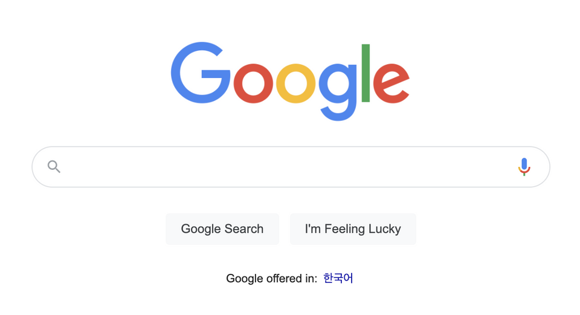
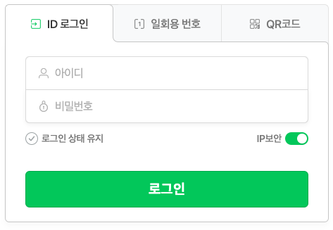
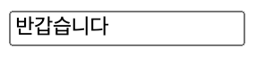
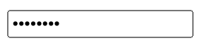
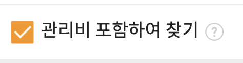

# Key Event

- click Event 다음으로 사용자에서 자주 발생되는 이벤트가 key Event 임
  - 키보드에서 키를 누를 때 발생하는 keydown 이벤트와
  - 키를 눌렀다가 뗐을 때 발생하는 keyup 이벤트가 있음
- 키보드를 치면 무조건 키를 누르고, 떼는 일이 둘 다 발생하므로(영원히 키를 누르고 떼지 않는 경우는 없음) 키보드를 한 번 누를 때 항상 keyup, keydown 이벤트가 각각 일어남
- 그래서 키보드를 눌렀을 때 발생하는 이벤트를 감지 하고 싶으면, 둘중에 하나를 선택하면 됨

```
요소.addEventListener('keydown', function() {
	// 키를 누른 직후 발생
});

요소.addEventListener('keyup', function() {
	// 키를 뗐을 때 발생 (keyup 일어난 후 발생)
});
```

<br>

## 1) input 태그




- key Event가 발생하는 요소는 대부분 `<input>`태그 임. 사용자가 `<input>` 태그에 키보드로 값을 입력할 때 발생
  - input 태그와 상관 없이 일반 웹사이트에서 키보드를 눌러도 key Event를 감지해서 동작이 일어나게 할 수 있지만, 사용자는 대부분 input요소에서 키보드를 클릭하겠죠?

<br>

## 1-2) 다양한 type의 input 태그

### type="text"



```
<input type="text" placehoder="반갑습니다" >
```

- text 타입은 한 줄 짜리 일반 텍스트를 입력하는 필드
- 주로 id나 이름, 주소 등의 텍스틀 입력할 때 사용

<br>

### type="password"



```
<input type="password">
```

- password는 말 그대로 비밀번호 입력란을 만듦
- 값이 보이면 안되기때문에 비밀번호는 입력하는 글자가 • 로 표시됨!

<br>

- type="checkbox", type="radio"



```
<input type="checkbox"> 관리비 포함하여 찾기
```

- 여러 항목 중 원하는 학몽을 선택할 때 사용하는 요소
- type="checkbox"는 여러 항목 중 다중 선택 가능!
- type="radio"는 주로 여러 항목 중 한개만 선택 해야 할때 사용!
