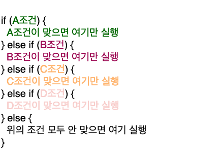

# if문(조건문)

- if문(조건문)은 말 그대로 "만약에 ~하면 ~한다" 가 컴퓨터 언어로 변환된 것
- 조건은 지난 시간에 배웠던 boolean타입으로 (true, false) 표현되는 값이어야 함

```
if (조건){
 // 로직
}

if (복권에 당첨된다) {
	세계일주를 한다.
}
```

## 1) 조건이 true인 경우 - if문 실행

```
let answer = 3 + 3;


if (answer > 5) {
  alert("5보다 큰 숫자군요!");
}
```

## 1-2) 조건이 false인 경우

- 조건이 거짓(false)일 땐 if문이 실행되지 않고, 그 다음 조건으로 넘어감
- 아래와 같이 아무 조건이 없는 else문이 있는 경우, else문이 실행 됨

```
let answer = 2 + 3;


if (answer > 5) {
  alert("5보다 큰 숫자!");
} else {
  alert("5보다 작거나 같은 숫자!");
}
```

## 1-3) 여러 조건 - else if

- 여러 개의 조건을 사용할 때는 else if를 사용함



```
let answer = 3 + 3;


if (answer > 15) {
  alert("15보다 큰 숫자!");
} else if (answer > 10) {
  alert("10보다 큰 숫자!");
} else if (answer > 5) {
  alert("5보다 큰 숫자!");
} else {
  alert("5보다 작거나 같은 숫자!");
}
```

- if 부터 마지막 else문까지 조건에 맞는 if문을 찾을 때까지 차례대로 실행함
- 위와 같은 경우 answer가 6이므로,

  - 첫 번째 if문은 15보다 작아서 지나치고,
  - 두 번째 else if문도 10보다 작아서 지나치고,
  - 세 번째 else if문에서, answer가 5보다 크니까 "5보다 큰 숫자!" 라는 알림창이 뜨게 됨

- 조건문을 보면 위에서부터 차례로 조건을 체크하며 내려온다는 사실을 알 수 있음, 조건문은 순서가 중요

<br>

# 비교연산자

- 비교 연산자란 연산자 양쪽에 있는 두 개의 값, 즉 좌항과 우항을 비교하는 연산자 임

## 2) 일치 연산자 (===)

- 연산자 양쪽에 있는 두 값과 데이터타입 모두가 같은지를 비교하는 연산자
- 결과로는 boolean(true 아니면 false)값이 나옴

```
let foo = 1;
let bar = 1;

let isSame = foo === bar;
console.log(isSame); // true
```

- 비교의 대상은 무엇이든 가능!

```
let a = 1 === "일";
let b = "배열" === [];
let c = 0 === true;

console.log(a) // "일"  -> false
console.log(b) // false
console.log(c) // false
```

## 2-2) 불일치 연산자(!==)

- !==를 사용해 서로 '같지않음' 을 확인할수도 있음

```
if (password !== "비밀번호1234") {
  alert("비밀번호를 확인해주세요.");
}
```

<br>

# 논리연산자

## 3-1) 논리 연산자의 필요성

```
if (answer === "선릉") {
  alert("위코드에서 가까우시네요!");
} else if (answer === "강남") {
  alert("위코드에서 가까우시네요!");
} else if (answer === "을지로") {
  alert("위코드에서 조금 멀리 사시네요.");
} else {
  alert("거긴 어디인가요?");
}
```

- 위의 조건문을 보면 answer가 선릉, 강남 일 땐 조건은 다르지만 같은 알림창의 문구가 나타남

```
if (선릉 또는 강남 또는 삼성 또는 역삼) {
    alert("위코드에서 가까우시네요!");
}
```

> 이렇게 같은 결과에 해당하는 조건이 있다면 묶을 수 있음!

## 3-2) 논리 연산자 - 또는(or) (||)

- "또는 (or)" 에 해당하는 JAvaScript 연산자는 || 임

```
if (answer === "선릉" || answer === "강남" || answer === "역삼") {
  alert("위코드에서 가까우시네요!");
} else if (answer === "을지로") {
  alert("위코드에서 조금 멀리 사시네요.");
} else {
 alert("거긴 어디인가요?");
}

```

- 세 가지 조건 중에, 하나만 만족하면 첫 번째 if문이 실행 됨

## 3-3) 논리 연산자 - 그리고(and) (&&)

- 조건 하나만 맞으면 되는 것이 아니라 모두 충족해야 할땐 "그리고(and)" 연산자인 &&를 사용함

```
if (hobbyValue === "축구" && morningPerson === true) {
	  alert("조기축구회를 추천합니다.");
	} else {
	  alert("무슨 동아리가 좋을지 생각해볼게요.");
	}
```

- 취미가 꼭 축구여야 하고, 아침형 인간만 조기 축구회를 추천함(취미가 축구인데, 저녁형 인간이면 추천 안한다는 뜻)
