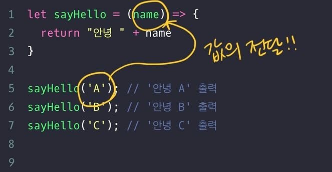

# 함수 - 데이터 받아서 활용, 매개변수와 인자

## input(매개변수)을 받는 함수가 필요한 이유

```
let sayHelloToJ = () => {
  return "안녕 J"
}

let sayHelloToK = () => {
  return "안녕 K"
}
```

> J와 K에게 인사하는 함수

- 하지만 2명이 아니라 여러명이라면?


- 인사하는 함수를 만들고
- 인자는 J or K or P or Y ....
- 결과(반환값, return 값)는 안녕J 안녕K 안녕P 안녕Y

## input 데이터 보내고 받기

```
let sayHello = (name) => {  // 받는 데이터가 매개변수(parameter)
  return "안녕 " + name
}

sayHello('K');  // 보내는 데이터가 인자(argument)
```

### 1)매개변수(parameter)

```
let sayHello = (name) => {  // 받는 데이터가 매개변수(parameter)
  return "안녕 " + name
}

sayHello('K');  // 보내는 데이터가 인자(argument)
```

- 아래 정의된 함수의 소괄호에 지금까지 본 함수와 달리 name 이라는 단어가 들어있음
- 함수를 정의할 때 소괄호 안에 들어가는 값을 매개변수라고 함
- `매개 변수는 외부로부터 들어오는 값을 담아 함수 내부에서 사용하도록 하는 변수의 역할을 함 (함수 외부로부터 들어올 값이 담길 자리)`
- 매개변수 이름은 원하는대로 지을 수 있음

### 2)인자(arguments)

- 인자는 실행할 함수에 전달하는 값, 함수를 호출할 때 소괄호()에 넣어줌
- 위에 설명했듯 함수의 정의에 매개변수(외부로부터 들어올 값이 담길 자리)에, 인자로 값을 보내는 것

```
let result = sayHello("W");

console.log(result); // '안녕 W'가 출력됩니다.
```

- sayHello 함수를 호출할 때, 소괄호 안에 "W"라는 인자를 전달
  > 아래 코드의 실행 순서는?



1 -> 5 -> 2 -> 6 -> 2 -> 7 -> 2 -> 8

1. 함수의 정의
2. 함수 호출
3. 함수 실행
4. 함수 호출
5. 함수 실행
6. 함수 호출
7. 함수 실행

<br>

### 2-1) 함수 내부에서 다른 함수 호출하기

```
// 가격을 매개변수로 받아서 10%의 세금을 구하는 함수
let getTax = (price) => {
  return price * 0.1;
}

// 가격을 매개변수로 받고 원래 가격에 세금을 더하는 함수
let calculateTotal = (price) => {
  return price + getTax(price);
}

let result = calculateTotal(3500);
console.log(result);
```

- calculateTotal 함수 내부에서 getTax를 호출함

### 2-2) 두 가지 이상의 인자

```
let add = (a, b) => {
  return a + b
}

console.log(add(3, 6));
```

- 함수에 인수가 한 개가 아닌 여러 개 전달할 수도 있음. 쉼표로 구분해야 함!
- 순서가 매우매우 중요
- 사실 addEventListener도 함수 임. 우리가 정의하진 않았지만, 이미 정의되어 우리가 호출만 하면 됨

```
loginButton.addEventListener('click', function() {
	const idValue = document.getElementById('아이디input').value;
	const pwValue = document.getElementById('비밀번호input').value;

	네이버로그인확인(idValue, pwValue);
});
```

- addEventListener 함수는 2개의 인자를 받음
- 첫 번째는 이벤트명(string:문자열), 두 번째는 이벤트가 발생했을 때 실행할 코드(function: 함수)

### 2-3) 최소, 최대 값을 인자로 받아 Random 수 반환

```
function randomNum() {
  let randomNumUnder755 = Math.floor(Math.random() * 755);

  return randomNumUnder755;
}
```

- 위의 함수는 0 ~ 755 사이에서 난수(Random수) 를 생성하고 있음

```
function randomRange(min, max) {
  return Math.floor(Math.random() * (max + 1 - min)) + min;
}
```

> 지정된 범위에서 난수를 발생시키는 또 다른 함수
