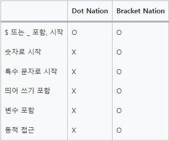

# 객체에 접근하는 방법이 두 가지인 이유

## 1.도트 접근법[Dot notation]

## 객체.key

```
var myObj = {
	name: '이은지',
	age: 28,
	hello: function(){
	return `이름은 ${this.name}이고, 나이는 ${this.age}입니다.`;
	}
};
console.log(myObj.name); // '이은지'
console.log(myObj.age); // 28
console.log(myObj.hello()); // '이름은 이은지이고, 나이는 28입니다.'
```

- 숫자로 시작하는 키에 접근할 수 없음
- 띄어쓰기가 포함된 키에 접근할 수 없음
- 변수가 포함되어 있으면 접근할 수 없음

<br>
<br>

## 2. 대괄호 접근법(Bracket notation)

## 객체['key']

```
myObj['name']; // '이은지'
myObj['age'];  // 28
myObj['hello'](); // '이름은 이은지이고, 나이는 28입니다.'
```

> 대괄호 방식은 key가 따옴표로 감싸져 있지 않으면 변수로 해석해서 참조

- 도트 접근법이 못하는 것을 모두 가능

<br>
<br>

# 두 접근 방법의 차이점



<br>

# 객체 접근 방법은 왜 2가지일까?

property 를 변수로 접근 가능 여부로 방법이 나눠진 것
'[]'표현은 변수로 접근 가능하지만
'.'표현은 변수로 접근 불가, 바로 객체의 속성에 접근함

## 어떤 표기법을 사용하는 것이 좋을까?

- 출력 결과는 동일하지만, 기본적으로 점 표기법을 사용하는 것이 좋음

## 점 표기법을 권장하는 이유

- 사용하기 쉬움
- 대괄호 표기법에 비해 타이핑이 빠름

## 점 표기법의 한계

점 표기볍은 식별자로 동작한다는 한계가 있음

- 식별자 작성 규칙
  - 대소문자를 구분
  - 일부 특수 문자$, \_를 허용
  - 숫자로 시작할 수 없음

## !!!!!

- 일반적으로는 점 표기법을 사용하는 것이 좋음
  그러나 식별자 또는 변수로 속성을 접근해야 하는 경우에는 대괄호 표기법을 사용
  - '[ ]'는 변수를 통해 객체로 접근 가능, 직접 접근도 가능
  - '.'는 변수로 객체 접근 불가, 객체로 바로 접근
