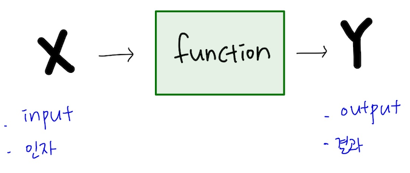

# 함수 값 반환(return)

## 함수의 결과물 - return

### 1) 값의 반환



```
// 함수의 정의
function addNumber() {
	let value = 1 + 1;
	return value;
}

// 함수의 호출(실행)은 여러번 할 수 있다.
addNumber();
addNumber();
addNumber();

// 함수 실행의 결과값을 보는 방법 1
console.log(addNumber());

// 함수 실행의 결과값을 보는 방법 2
let returnValue = addNumber();
console.log(returnValue);
```

- 모든 함수는 반환(return)값이 있음. return 이라는 키워드 우측에 원하는 값을 입력하면 됨

```
// 함수의 정의
function welcome() {
	console.log("환영합니다.")
}

let returnValue = welcome();
console.log(returnValue);
```

- 위와 같이 return이 생략되는 경우도 있음. 함수가 반환을 생략하면 undefined 라는 값을 반환함!

### 1-2) 함수의 종료

- return은 값을 반환하는 것 말고도 함수를 종료시키는 역할을 함. 함수 몸통안에 있는 코드가 차례대로 실행되다가 return을 만나면, return 값을 반환하고 종료됨
- return 아래에 몇 줄의 코드가 있든 없든 상관없이 바로 종료됨!

```
let sayHello = () => {
	let name = "김코드";
	console.log("반갑습니다");
  return "안녕하세요" + name + "님"
	console.log("다음에 또 뵈요!");
}

sayHello();
```

- 첫 번째 콘솔은 정상적으로 실행되서 "반갑습니다"를 볼 수 있음
- return을 만나서 값을 반환함
- 반환 후에 함수를 즉시 종료
- "다음에 또 뵈요!" 콘솔을 바로 위에서 return으로 인해 함수가 종료 됐기 때문에 볼 수 없음

<br>

## `ex)`

```
document.addEventListener('keydown', function (e) {
  const heroLeft = heroElement.style.left;
  const heroLeftWithoutPx = Number(heroLeft.split('px')[0]);

  // 용사의 left가 0보다 작아지거나 or 765(BG_WIDTH-HERO_WIDTH)보다 커질 떄
  if (
    (heroLeftWithoutPx - 10 < 0 && e.keyCode === 37) ||
    (heroLeftWithoutPx + 10 > BG_WIDTH - HERO_WIDTH && e.keyCode === 39)
  ) {
    // return..  함수를 종료
    return;
  }

  if (e.keyCode === 37) {
    heroElement.style.left = heroLeftWithoutPx - 10 + 'px';
    heroElement.className = 'left';

  } else if (e.keyCode === 39) {
    heroElement.style.left = heroLeftWithoutPx + 10 + 'px';
    heroElement.className = 'right';
  }
});
```
